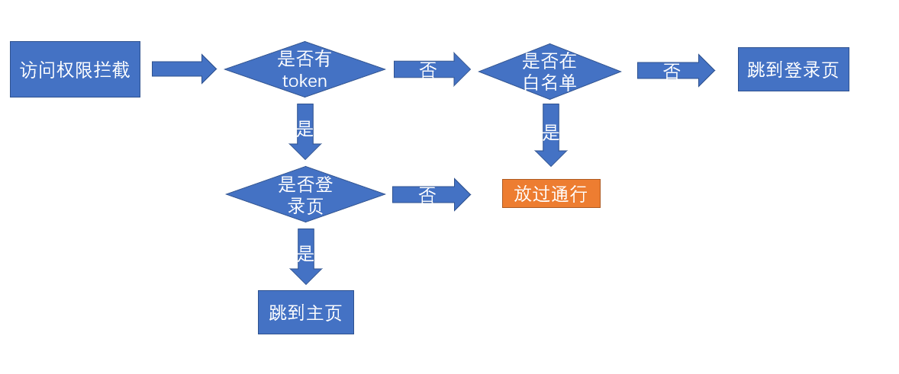
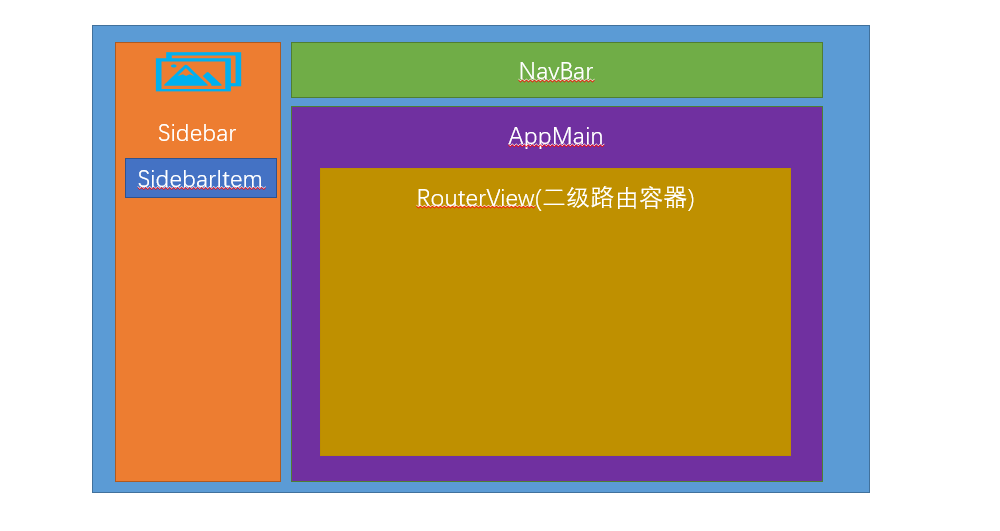
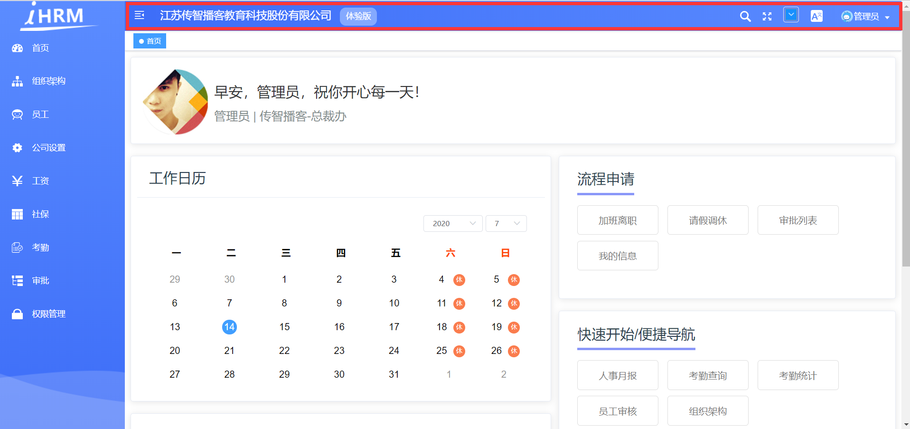
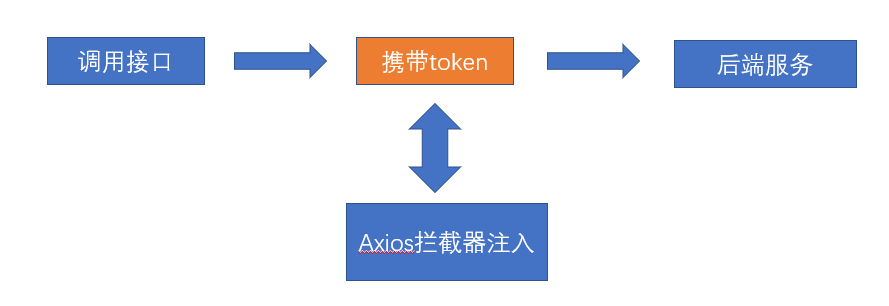
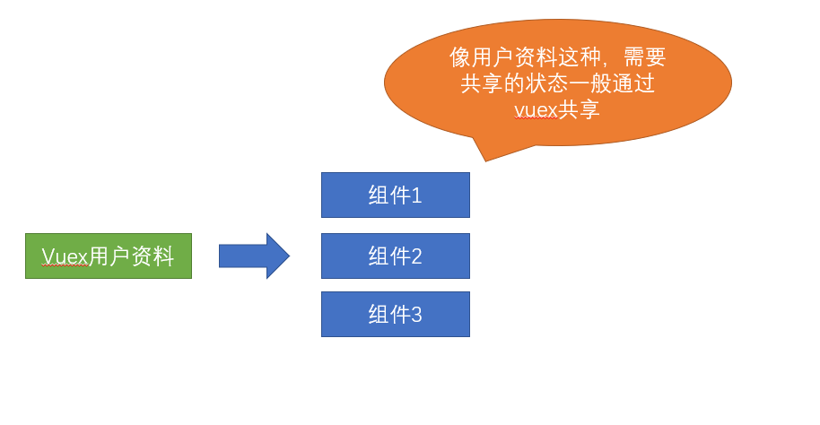
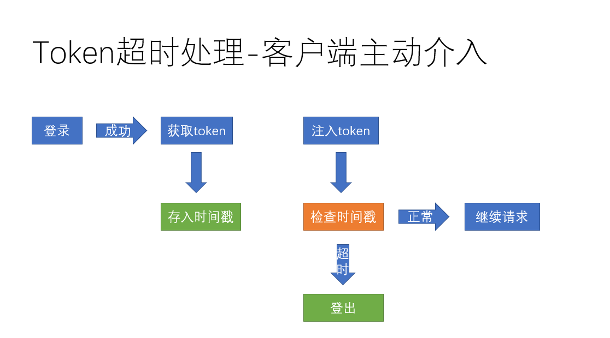
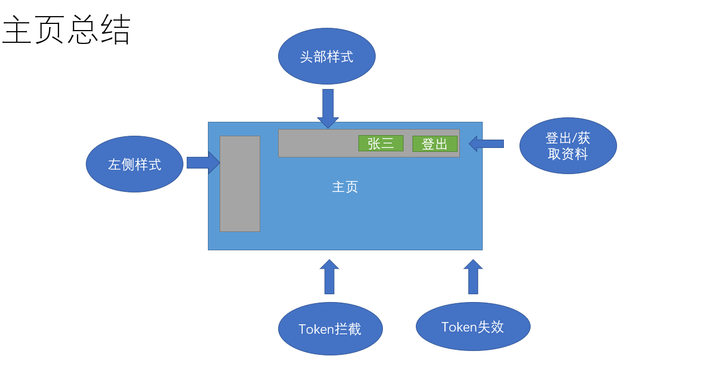

## 主页的token拦截处理

**`目标`**：根据token处理主页的访问权限问题

### 权限拦截的流程图

> 我们已经完成了登录的过程，并且存储了token，但是此时主页并没有因为token的有无而被控制访问权限

接下来我们需要实现以下如下的流程图



> 在基础框架阶段，我们已经知道**`src/permission.js`**是专门处理路由权限的，所以我们在这里处理

### 流程图转化代码

**流程图转化的代码**

```js
// 权限拦截 导航守卫 路由守卫  router
import router from '@/router' // 引入路由实例
import store from '@/store' // 引入vuex store实例
import NProgress from 'nprogress' // 引入一份进度条插件
import 'nprogress/nprogress.css' // 引入进度条样式

const whiteList = ['/login', '/404'] // 定义白名单  所有不受权限控制的页面
// 路由的前置守卫
router.beforeEach(function(to, from, next) {
  NProgress.start() // 开启进度条
  //  首先判断有无token
  if (store.getters.token) {
    //   如果有token 继续判断是不是去登录页
    if (to.path === '/login') {
      //  表示去的是登录页
      next('/') // 跳到主页
    } else {
      next() // 直接放行
    }
  } else {
    // 如果没有token
    if (whiteList.indexOf(to.path) > -1) {
      // 如果找到了 表示在在名单里面
      next()
    } else {
      next('/login') // 跳到登录页
    }
  }
  NProgress.done() // 手动强制关闭一次  为了解决 手动切换地址时  进度条的不关闭的问题
})
// 后置守卫
router.afterEach(function() {
  NProgress.done() // 关闭进度条
})

```

> 在导航守卫的位置，我们添加了NProgress的插件，可以完成进入时的进度条效果

**提交代码**

**`本节任务`**：完成主页中根据有无token，进行页面访问的处理

## 主页的左侧导航样式

**`目标`**设置左侧的导航样式

> 接下来我们需要将左侧导航设置成如图样式


> 主页的布局组件位置**`src/layout`**

**主页布局架构**




**左侧导航组件的样式文件**`styles/siderbar.scss`

**设置背景渐变色**

```css
.sidebar-container {
      background: -webkit-linear-gradient(bottom, #3d6df8, #5b8cff);
}
```

**设置左侧导航背景图片**

```scss
.scrollbar-wrapper { 
    background: url('~@/assets/common/leftnavBg.png') no-repeat 0 100%;
}
```

**`注意`**：在scss中，如果我们想要使用**`@`**别名，需要在前面加上一个**`~`**才可以

**设置菜单选中颜色**

```bash
    .el-menu {
      border: none;
      height: 100%;
      width: 100% !important;
      a{
        li{
          .svg-icon{
            color: #fff;
            font-size: 18px;
            vertical-align: middle;
            .icon{
              color:#fff;
            }
          }
          span{
            color: #fff;
          }
          &:hover{
            .svg-icon{
              color: #43a7fe
            }
            span{
              color: #43a7fe;
            }
          }
        }
      }
    }
```

**`注意`**：因为我们后期没有二级菜单，所以这里暂时不用对二级菜单的样式进行控制

**显示左侧logo图片** **`src/setttings.js`**

```js
module.exports = {

  title: '人力资源管理平台',

  /**
   * @type {boolean} true | false
   * @description Whether fix the header
   */
  fixedHeader: false,

  /**
   * @type {boolean} true | false
   * @description Whether show the logo in sidebar
   */
  sidebarLogo: true // 显示logo
}

```

**设置头部图片结构** **`src/layout/components/Sidebar/Logo.vue`**

```vue
<div class="sidebar-logo-container" :class="{'collapse':collapse}">
    <transition name="sidebarLogoFade">
      <router-link key="collapse" class="sidebar-logo-link" to="/">
        
      </router-link>
    </transition>
  </div>
```

**设置大图和小图的样式**

```scss
  &.collapse {
    .sidebar-logo {
      margin-right: 0px;
      width: 32px;
      height: 32px;
    }
  }
// 小图样式
```

```scss
.sidebar-logo {
      width: 140px;
      vertical-align: middle;
      margin-right: 12px;
}
// 大图样式
```

**去除logo的背景色**


**提交代码**

**`本节任务`**： 完成主页的左侧导航样式

**`本节注意`**：我们该项目中没有二级显示菜单，所以二级菜单的样式并没有做过多处理，同学们不必在意

## 设置头部内容的布局和样式

**`目标`**设置头部内容的布局和样式

> 我们需要把页面设置成如图样式



**头部组件位置** **`layout/components/Navbar.vue`**

**添加公司名称**，**注释面包屑**

```html
  <div class="app-breadcrumb">
      江苏传智播客教育科技股份有限公司
      <span class="breadBtn">体验版</span>
  </div>
 <!-- <breadcrumb class="breadcrumb-container" /> -->

```

**公司样式**

```scss
.app-breadcrumb {
  display: inline-block;
  font-size: 18px;
  line-height: 50px;
  margin-left: 10px;
  color: #ffffff;
  cursor: text;
  .breadBtn {
    background: #84a9fe;
    font-size: 14px;
    padding: 0 10px;
    display: inline-block;
    height: 30px;
    line-height: 30px;
    border-radius: 10px;
    margin-left: 15px;
  }
}
```

**头部背景渐变色**

```scss
.navbar {
    background-image: -webkit-linear-gradient(left, #3d6df8, #5b8cff);
}
```

**汉堡组件图标颜色**  **`src/components/Hamburger/index.vue`**

**`注意`**这里的图标我们使用了**`svg`**，设置颜色需要使用svg标签的**`fill属性`**

> 设置svg图标为白色

```vue
<svg
      :class="{'is-active':isActive}"
      class="hamburger"
      viewBox="0 0 1024 1024"
      xmlns="http://www.w3.org/2000/svg"
      width="64"
      height="64"
      fill="#fff" 
    >
```

**右侧下拉菜单设置**

> 将下拉菜单调节成**`首页/项目地址/退出登录`**

```vue
    <div class="right-menu">
      <el-dropdown class="avatar-container" trigger="click">
        <div class="avatar-wrapper">
          
          <span class="name">管理员</span>
          <i class="el-icon-caret-bottom" style="color:#fff" />
        </div>
        <el-dropdown-menu slot="dropdown" class="user-dropdown">
          <router-link to="/">
            <el-dropdown-item>
              首页
            </el-dropdown-item>
          </router-link>
          <a target="_blank" href="https://gitee.com/shuiruohanyu/hrsaas53">
            <el-dropdown-item>项目地址</el-dropdown-item>
          </a>
          <el-dropdown-item divided @click.native="logout">
            <span style="display:block;">退出登录</span>
          </el-dropdown-item>
        </el-dropdown-menu>
      </el-dropdown>
    </div>
```

**头像和下拉菜单样式**

```css
  .user-avatar {
          cursor: pointer;
          width: 30px;
          height: 30px;
          border-radius: 15px;
          vertical-align: middle;

   }
   .name {
          color: #fff;
          vertical-align: middle;
          margin-left:5px;
   }
   .user-dropdown {
           color: #fff;
    }
```

用户名和头像我们先用了假数据进行，下小章节，会进行这份数据的获取

**最终效果**


**提交代码**

##  获取用户资料接口和token注入

**`目标`** 封装获取用户资料的资料信息

> 上小节中，我们完成了头部菜单的基本布局，但是用户的头像和名称并没有，我们需要通过接口调用的方式获取当前用户的资料信息

**获取用户资料接口**

在**`src/api/user.js`**中封装获取用户资料的方法

```js
/**
 *  获取用户的基本资料
 *
 * **/
export function getUserInfo() {
  return request({
    url: '/sys/profile',
    method: 'post'
  })
}
```

> 我们忽略了一个问题！我们的headers参数并没有在这里传入，为什么呢

headers中的**Authorization**相当于我们**开门**（**调用接口**）时**`钥匙(token)`**，我们在打开任何带安全权限的门的时候都需要**`钥匙(token)`** 如图


每次在接口中携带**`钥匙（token）`**很麻烦，所以我们可以在axios拦截器中统一注入token 



**统一注入token** **`src/utils/request.js`**

```js
service.interceptors.request.use(config => {
  // 在这个位置需要统一的去注入token
  if (store.getters.token) {
    // 如果token存在 注入token
    config.headers['Authorization'] = `Bearer ${store.getters.token}`
  }
  return config // 必须返回配置
}, error => {
  return Promise.reject(error)
}) 
```

**`本节任务`**： 完成获取用户资料接口和token注入

## 封装获取用户资料的action并共享用户状态

**`目标`**： 在用户的vuex模块中封装获取用户资料的action，并设置相关状态

> 用户状态会在后续的开发中，频繁用到，所以我们将用户状态同样的封装到action中



**封装获取用户资料action**   **`action`**  **`src/store/modules/user.js`**

```js
import { login, getUserInfo } from '@/api/user'
  
  // 获取用户资料action
  async getUserInfo (context) {
    const result = await getUserInfo()  // 获取返回值
    context.commit('setUserInfo', result) // 将整个的个人信息设置到用户的vuex数据中
    return result // 这里为什么要返回 为后面埋下伏笔
  }
```

> 同时，配套的我们还进行了关于用户状态的mutations方法的设计

**初始化state**  **`state`**

```js
const state = {
  token: getToken(), // 设置token初始状态   token持久化 => 放到缓存中
  userInfo: {} // 定义一个空的对象 不是null 因为后边我要开发userInfo的属性给别人用  userInfo.name
}
```

> userInfo为什么我们不设置为null，而是设置为 {} 

因为我们会在**`getters`**中引用userinfo的变量，如果设置为null，则会引起异常和报错

**设置和删除用户资料**   **`mutations`**

```js
 // 设置用户信息
  setUserInfo(state, userInfo) {
    state.userInfo = { ...userInfo } // 用 浅拷贝的方式去赋值对象 因为这样数据更新之后，才会触发组件的更新
  },
  // 删除用户信息
  reomveUserInfo(state) {
    state.userInfo = {}
  }
```

> 同学们，我们将所有的资料设置到了**userInfo**这个对象中，如果想要取其中一个值，我们还可以在getters中建立相应的映射

因为我们要做映射，如果初始值为null，一旦引用了getters，就会报错

**建立用户名的映射**  **`src/store/getters.js`**

```js
const getters = {
  sidebar: state => state.app.sidebar,
  device: state => state.app.device,
  token: state => state.user.token,
  name: state => state.user.userInfo.username // 建立用户名称的映射
}
export default getters

```

到现在为止，我们将用户资料的**action =>  mutation => state =>  getters** 都设置好了， 那么我们应该在什么位置来调用这个action呢 ？

> 别着急，先提交代码，下个小节，我们来揭晓答案

**提交代码**

**`本节任务`**封装获取用户资料的action并共享用户状态

## 权限拦截处调用获取资料action

**`目标`**在权限拦截处调用aciton

### 权限拦截器调用action

> 在上小节中，我们完成了用户资料的整个流程，那么这个action在哪里调用呢？

用户资料有个硬性要求，**`必须有token`**才可以获取，那么我们就可以在确定有token的位置去获取用户资料


> 由上图可以看出，一旦确定我们进行了放行，就可以获取用户资料


**调用action** **`src/permission.js`**

```js
 if(!store.state.user.userInfo.userId) {
       await store.dispatch('user/getUserInfo')
 }
```

如果我们觉得获取用户id的方式写了太多层级，可以在vuex中的getters中设置一个映射 **`src/store/getters.js`**

```js
  userId: state => state.user.userInfo.userId // 建立用户id的映射
```

代码就变成了

```js
 if (!store.getters.userId) {
        // 如果没有id这个值 才会调用 vuex的获取资料的action
        await store.dispatch('user/getUserInfo')
        // 为什么要写await 因为我们想获取完资料再去放行
      }
```

此时，我们可以通过dev-tools工具在控制台清楚的看到数据已经获取


> 最后一步，只需要将头部菜单中的名称换成真实的用户名即可

### 获取头像接口合并数据

**头像怎么办？**

> 我们发现头像并不在接口的返回体中（接口原因），我们可以通过另一个接口来获取头像，并把头像合并到当前的资料中

**封装获取用户信息接口**  **`src/api/user.js`**

```js
/** *
 *
 * 获取用户的基本信息  现在写它 完全是为了显示头像
 * **/
export function getUserDetailById(id) {
  return request({
    url: `/sys/user/${id}`
  })
}
```

> 这个接口需要用户的userId，在前一个接口处，我们已经获取到了，所以可以直接在后面的内容去衔接

```js
import { login, getUserInfo, getUserDetailById } from '@/api/user'
 
// 获取用户资料action
 async getUserInfo(context) {
    const result = await getUserInfo() // result就是用户的基本资料
    const baseInfo = await getUserDetailById(result.userId) // 为了获取头像
    const baseResult = { ...result, ...baseInfo } // 将两个接口结果合并
    // 此时已经获取到了用户的基本资料 迫不得已 为了头像再次调用一个接口
    context.commit('setUserInfo', baseResult) // 提交mutations
    // 加一个点睛之笔  这里这一步，暂时用不到，但是请注意，这给我们后边会留下伏笔
    return baseResult
  }
```

> 为了更好地获取头像，同样可以把头像放于getters中

```js
  staffPhoto: state => state.user.userInfo.staffPhoto // 建立用户头像的映射
```

此时，我们的头像和名称已经获取到了，可以直接将之前的假数据换成真正的头像和名称

**用户名**  **`layout/components/Navbar.vue`**

```js
 ...mapGetters([
      'sidebar',
      'name',
      'staffPhoto'
    ])
     
     <span class="name">{{ name }}</span>

```

> 通过设置，用户名已经显示，头像依然没有显示，这是因为虽然有地址，但是地址来源是私有云，目前已经失效，所以需要额外处理下图片的异常


至于处理图片的异常，我们在下一节中，可采用自定义指令的形式来进行处理

**`本节任务`**：实现权限拦截处调用获取资料action

## 自定义指令-解决异常图片情况

**`目标`**： 通过自定义指令的形式解决异常图片的处理

### 自定义指令

注册自定义指令

```js
Vue.directive('指令名称', {
    // 会在当前指令作用的dom元素 插入之后执行
    // options 里面是指令的表达式
    inserted: function (dom,options) {
        
    }
})
```

> 自定义指令可以采用统一的文件来管理  **`src/directives/index.js`**,这个文件负责管理所有的自定义指令

首先定义第一个自定义指令  **`v-imagerror`**

```js
export const imagerror = {
  // 指令对象 会在当前的dom元素插入到节点之后执行
  inserted(dom, options) {
    // options是 指令中的变量的解释  其中有一个属性叫做 value
    // dom 表示当前指令作用的dom对象
    // dom认为此时就是图片
    // 当图片有地址 但是地址没有加载成功的时候 会报错 会触发图片的一个事件 => onerror
    dom.onerror = function() {
      // 当图片出现异常的时候 会将指令配置的默认图片设置为该图片的内容
      // dom可以注册error事件
      dom.src = options.value // 这里不能写死
    }
  }
}

```

### 在main.js完成自定义指令全局注册

然后，在**`main.js`**中完成对于该文件中所有指令的全局注册 

```js
import * as directives from '@/directives'
// 注册自定义指令
// 遍历所有的导出的指令对象 完成自定义全局注册
Object.keys(directives).forEach(key => {
  // 注册自定义指令
  Vue.directive(key, directives[key])
})
```

针对上面的引入语法  **`import *  as  变量`**  得到的是一个对象**`{ 变量1：对象1，变量2： 对象2 ...   }`**, 所以可以采用对象遍历的方法进行处理

指令注册成功，可以在**`navbar.vue`**中直接使用了

```vue

```

```js
 data() {
    return {
      defaultImg: require('@/assets/common/head.jpg')
    }
  },
```

**`本节任务`**：实现一个自定义指令，解决图片加载异常的问题

## 实现登出功能

**`目标`**：实现用户的登出操作

> 登出仅仅是跳到登录页吗？

不，当然不是，我们要处理如下


同样的，登出功能，我们在vuex中的用户模块中实现对应的**action**

**登出action**  **`src/store/modules/user.js`**

```js
// 登出的action
  logout(context) {
    // 删除token
    context.commit('removeToken') // 不仅仅删除了vuex中的 还删除了缓存中的
    // 删除用户资料
    context.commit('removeUserInfo') // 删除用户信息
  }
```

**头部菜单调用action**  **`src/layout/components/Navbar.vue`**

```js
  async logout() {
      await this.$store.dispatch('user/logout') // 这里不论写不写 await 登出方法都是同步的
      this.$router.push(`/login`) // 跳到登录
  }
```

**`注意`**我们这里也可以采用vuex中的模块化引入辅助函数

```js
import { mapGetters, createNamespacedHelpers  } from 'vuex'
const {  mapActions } = createNamespacedHelpers('user') // 这是的mapAction直接对应模块下的action辅助函数
  methods: {
    ...mapActions(['lgout']),
  }
```

以上代码，实际上直接对user模块下的action进行了引用，

**提交代码**

**`本节任务`**： 实现登出功能

## q

**`目标`**： 处理当token失效时业务

### 主动介入token处理的业务逻辑

> 开门的钥匙不是一直有效的，如果一直有效，会有安全风险，所以我们尝试在客户端进行一下token的时间检查

具体业务图如下



### 流程图转化代码

**流程图转化代码** **`src/utils/auth.js`**

```js
const timeKey = 'hrsaas-timestamp-key' // 设置一个独一无二的key

// 获取时间戳
export function getTimeStamp() {
  return Cookies.get(timeKey)
}
// 设置时间戳
export function setTimeStamp() {
  Cookies.set(timeKey, Date.now())
}


```

**`src/utils/request.js`**

```js
import axios from 'axios'
import store from '@/store'
import router from '@/router'
import { Message } from 'element-ui'
import { getTimeStamp } from '@/utils/auth'
const TimeOut = 3600 // 定义超时时间

const service = axios.create({
// 当执行 npm run dev  => .evn.development => /api => 跨域代理
  baseURL: process.env.VUE_APP_BASE_API, // npm  run dev  => /api npm run build =>  /prod-api
  timeout: 5000 // 设置超时时间
})
// 请求拦截器
service.interceptors.request.use(config => {
  // config 是请求的配置信息
  // 注入token
  if (store.getters.token) {
    // 只有在有token的情况下 才有必要去检查时间戳是否超时
    if (IsCheckTimeOut()) {
      // 如果它为true表示 过期了
      // token没用了 因为超时了
      store.dispatch('user/logout') // 登出操作
      // 跳转到登录页
      router.push('/login')
      return Promise.reject(new Error('token超时了'))
    }
    config.headers['Authorization'] = `Bearer ${store.getters.token}`
  }
  return config // 必须要返回的
}, error => {
  return Promise.reject(error)
})
// 响应拦截器
service.interceptors.response.use(response => {
  // axios默认加了一层data
  const { success, message, data } = response.data
  //   要根据success的成功与否决定下面的操作
  if (success) {
    return data
  } else {
    // 业务已经错误了 还能进then ? 不能 ！ 应该进catch
    Message.error(message) // 提示错误消息
    return Promise.reject(new Error(message))
  }
}, error => {
  Message.error(error.message) // 提示错误信息
  return Promise.reject(error) // 返回执行错误 让当前的执行链跳出成功 直接进入 catch
})
// 是否超时
// 超时逻辑  (当前时间  - 缓存中的时间) 是否大于 时间差
function IsCheckTimeOut() {
  var currentTime = Date.now() // 当前时间戳
  var timeStamp = getTimeStamp() // 缓存时间戳
  return (currentTime - timeStamp) / 1000 > TimeOut
}
export default service

```

**`本节注意`**：我们在调用登录接口的时候 一定是没有token的，所以token检查不会影响登录接口的调用

> 同理，在登录的时候，如果登录成功，我们应该设置时间戳

```js
  // 定义login action  也需要参数 调用action时 传递过来的参数
  // async 标记的函数其实就是一个异步函数 -> 本质是还是 一个promise
  async login(context, data) {
    // 经过响应拦截器的处理之后 这里的result实际上就是 token
    const result = await login(data) // 实际上就是一个promise  result就是执行的结果
    // axios默认给数据加了一层data
    // 表示登录接口调用成功 也就是意味着你的用户名和密码是正确的
    // 现在有用户token
    // actions 修改state 必须通过mutations
    context.commit('setToken', result)
    // 写入时间戳
    setTimeStamp() // 将当前的最新时间写入缓存
  }
```

**提交代码**

> 有主动处理就有被动处理，也就是后端告诉我们超时了，我们被迫做出反应，如果后端接口没有做处理，主动介入就是一种简单的方式

**`本节任务`**：完成token超时的主动介入

## Token失效的被动处理

**`目标`**： 实现token失效的被动处理

> 除了token的主动介入之外，我们还可以对token进行被动的处理，如图


token超时的错误码是**`10002`**

**代码实现**  **`src/utils/request.js`**

```js
error => {
  // error 信息 里面 response的对象
  if (error.response && error.response.data && error.response.data.code === 10002) {
    // 当等于10002的时候 表示 后端告诉我token超时了
    store.dispatch('user/logout') // 登出action 删除token
    router.push('/login')
  } else {
    Message.error(error.message) // 提示错误信息
  }
  return Promise.reject(error)
}
```

> 无论是主动介入还是被动处理，这些操作都是为了更好地处理token，减少错误异常的可能性

**`本节任务`**  Token失效的被动处理

## 总结

本章节我们一步步实现了如下的效果


实际的业务走向



实际上，我们的主页功能有一个重要的**`角色权限`**功能还没有完成，此功能等到我们完成基本业务之后再进行展开

中台大型后端平台的深入是一个**`抽丝剥茧`**的过程，循序渐进的明白每一步的操作是非常关键的。

  